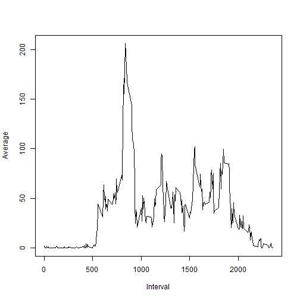

Reproducible Research: Peer Assessment 1
=========================================

## Loading and preprocessing the data

```r
Sys.setlocale("LC_TIME", "English")
```

```
## [1] "English_United States.1252"
```

```r
library("dplyr")
library("lattice")
unzip("activity.zip", "activity.csv")
activity <- read.csv("activity.csv")
```


## What is mean total number of steps taken per day?

**1. Make a histogram of the total number of steps taken each day**


```r
total_steps <- aggregate(activity$steps, list(activity$date), sum)
names(total_steps) <- c("date", "total.steps")
hist(total_steps$total.steps)
```

 

**2. Calculate and report the mean and median total number of steps taken per day:**


```r
mean_median_steps <- aggregate(activity$steps, list(activity$date), mean)
names(mean_median_steps) <- c("date", "mean.steps")
mean_median_steps$median.steps <- aggregate(activity$steps, list(activity$date), median)[,2]
print(mean_median_steps)
```

```
##          date mean.steps median.steps
## 1  2012-10-01         NA           NA
## 2  2012-10-02  0.4375000            0
## 3  2012-10-03 39.4166667            0
## 4  2012-10-04 42.0694444            0
## 5  2012-10-05 46.1597222            0
## 6  2012-10-06 53.5416667            0
## 7  2012-10-07 38.2465278            0
## 8  2012-10-08         NA           NA
## 9  2012-10-09 44.4826389            0
## 10 2012-10-10 34.3750000            0
## 11 2012-10-11 35.7777778            0
## 12 2012-10-12 60.3541667            0
## 13 2012-10-13 43.1458333            0
## 14 2012-10-14 52.4236111            0
## 15 2012-10-15 35.2048611            0
## 16 2012-10-16 52.3750000            0
## 17 2012-10-17 46.7083333            0
## 18 2012-10-18 34.9166667            0
## 19 2012-10-19 41.0729167            0
## 20 2012-10-20 36.0937500            0
## 21 2012-10-21 30.6284722            0
## 22 2012-10-22 46.7361111            0
## 23 2012-10-23 30.9652778            0
## 24 2012-10-24 29.0104167            0
## 25 2012-10-25  8.6527778            0
## 26 2012-10-26 23.5347222            0
## 27 2012-10-27 35.1354167            0
## 28 2012-10-28 39.7847222            0
## 29 2012-10-29 17.4236111            0
## 30 2012-10-30 34.0937500            0
## 31 2012-10-31 53.5208333            0
## 32 2012-11-01         NA           NA
## 33 2012-11-02 36.8055556            0
## 34 2012-11-03 36.7048611            0
## 35 2012-11-04         NA           NA
## 36 2012-11-05 36.2465278            0
## 37 2012-11-06 28.9375000            0
## 38 2012-11-07 44.7326389            0
## 39 2012-11-08 11.1770833            0
## 40 2012-11-09         NA           NA
## 41 2012-11-10         NA           NA
## 42 2012-11-11 43.7777778            0
## 43 2012-11-12 37.3784722            0
## 44 2012-11-13 25.4722222            0
## 45 2012-11-14         NA           NA
## 46 2012-11-15  0.1423611            0
## 47 2012-11-16 18.8923611            0
## 48 2012-11-17 49.7881944            0
## 49 2012-11-18 52.4652778            0
## 50 2012-11-19 30.6979167            0
## 51 2012-11-20 15.5277778            0
## 52 2012-11-21 44.3993056            0
## 53 2012-11-22 70.9270833            0
## 54 2012-11-23 73.5902778            0
## 55 2012-11-24 50.2708333            0
## 56 2012-11-25 41.0902778            0
## 57 2012-11-26 38.7569444            0
## 58 2012-11-27 47.3819444            0
## 59 2012-11-28 35.3576389            0
## 60 2012-11-29 24.4687500            0
## 61 2012-11-30         NA           NA
```

## What is the average daily activity pattern?

**1. Make a time series plot (i.e. type = "l") of the 5-minute interval (x-axis) and the average number of steps taken, averaged across all days (y-axis)**


```r
interval_steps <- summarise(group_by(activity, interval), mean(steps, na.rm=T))
names(interval_steps) <- c("interval", "mean.steps")
plot(interval_steps$interval, interval_steps$mean.steps, type = "l", xlab="Interval", ylab="Average")
```

 

```r
i <- which.max(interval_steps$mean.steps)
max <- interval_steps[i,1]
```
**2. Which 5-minute interval, on average across all the days in the dataset, contains the maximum number of steps?**

The 5-minute interval that contains the maximum number of steps is **835**.

## Imputing missing values

**1. Calculate and report the total number of missing values in the dataset (i.e. the total number of rows with NAs)**


```r
N <- sum(is.na(activity$steps))
```
The total number of NAs is **`2304`**.

**2. Devise a strategy for filling in all of the missing values in the dataset. The strategy does not need to be sophisticated. For example, you could use the mean/median for that day, or the mean for that 5-minute interval, etc.**

The selected imputation strategy will be: *to use the rounded mean for that 5-minutes interval averaged across all days*.

**3. Create a new dataset that is equal to the original dataset but with the missing data filled in.**


```r
new_activity <- activity
for (i in seq_len(nrow(new_activity))){
    if (is.na(new_activity[i,1])){
        interval_value <- new_activity[i,3]
        mean_index <- match(interval_value, interval_steps$interval)
        new_activity[i,1] <- round(interval_steps[mean_index,2],0)
    }
}
```

**4. Make a histogram of the total number of steps taken each day and Calculate and report the mean and median total number of steps taken per day. Do these values differ from the estimates from the first part of the assignment? What is the impact of imputing missing data on the estimates of the total daily number of steps?**

New histogram:

```r
new_total_steps <- aggregate(new_activity$steps, list(new_activity$date), sum)
names(new_total_steps) <- c("date", "total.steps")
hist(new_total_steps$total.steps, xlab='Total steps')
```

 

New mean and median:

```r
new_mean_median_steps <- aggregate(new_activity$steps, list(new_activity$date), mean)
names(new_mean_median_steps) <- c("date", "mean")
new_mean_median_steps$median <- aggregate(new_activity$steps, list(new_activity$date), median)[,2]
print(new_mean_median_steps)
```

```
##          date       mean median
## 1  2012-10-01 37.3680556   34.5
## 2  2012-10-02  0.4375000    0.0
## 3  2012-10-03 39.4166667    0.0
## 4  2012-10-04 42.0694444    0.0
## 5  2012-10-05 46.1597222    0.0
## 6  2012-10-06 53.5416667    0.0
## 7  2012-10-07 38.2465278    0.0
## 8  2012-10-08 37.3680556   34.5
## 9  2012-10-09 44.4826389    0.0
## 10 2012-10-10 34.3750000    0.0
## 11 2012-10-11 35.7777778    0.0
## 12 2012-10-12 60.3541667    0.0
## 13 2012-10-13 43.1458333    0.0
## 14 2012-10-14 52.4236111    0.0
## 15 2012-10-15 35.2048611    0.0
## 16 2012-10-16 52.3750000    0.0
## 17 2012-10-17 46.7083333    0.0
## 18 2012-10-18 34.9166667    0.0
## 19 2012-10-19 41.0729167    0.0
## 20 2012-10-20 36.0937500    0.0
## 21 2012-10-21 30.6284722    0.0
## 22 2012-10-22 46.7361111    0.0
## 23 2012-10-23 30.9652778    0.0
## 24 2012-10-24 29.0104167    0.0
## 25 2012-10-25  8.6527778    0.0
## 26 2012-10-26 23.5347222    0.0
## 27 2012-10-27 35.1354167    0.0
## 28 2012-10-28 39.7847222    0.0
## 29 2012-10-29 17.4236111    0.0
## 30 2012-10-30 34.0937500    0.0
## 31 2012-10-31 53.5208333    0.0
## 32 2012-11-01 37.3680556   34.5
## 33 2012-11-02 36.8055556    0.0
## 34 2012-11-03 36.7048611    0.0
## 35 2012-11-04 37.3680556   34.5
## 36 2012-11-05 36.2465278    0.0
## 37 2012-11-06 28.9375000    0.0
## 38 2012-11-07 44.7326389    0.0
## 39 2012-11-08 11.1770833    0.0
## 40 2012-11-09 37.3680556   34.5
## 41 2012-11-10 37.3680556   34.5
## 42 2012-11-11 43.7777778    0.0
## 43 2012-11-12 37.3784722    0.0
## 44 2012-11-13 25.4722222    0.0
## 45 2012-11-14 37.3680556   34.5
## 46 2012-11-15  0.1423611    0.0
## 47 2012-11-16 18.8923611    0.0
## 48 2012-11-17 49.7881944    0.0
## 49 2012-11-18 52.4652778    0.0
## 50 2012-11-19 30.6979167    0.0
## 51 2012-11-20 15.5277778    0.0
## 52 2012-11-21 44.3993056    0.0
## 53 2012-11-22 70.9270833    0.0
## 54 2012-11-23 73.5902778    0.0
## 55 2012-11-24 50.2708333    0.0
## 56 2012-11-25 41.0902778    0.0
## 57 2012-11-26 38.7569444    0.0
## 58 2012-11-27 47.3819444    0.0
## 59 2012-11-28 35.3576389    0.0
## 60 2012-11-29 24.4687500    0.0
## 61 2012-11-30 37.3680556   34.5
```
The new values of means and medians are only different from those where NAs where present in the previous table. For those completed days (withous NAs), mean and median values did not change.

After imputing the NA values, the histogram of total daily number os steps changed. It now looks more similar to a normal distribution.

## Are there differences in activity patterns between weekdays and weekends?

**1. Create a new factor variable in the dataset with two levels - "weekday" and "weekend" indicating whether a given date is a weekday or weekend day.**


```r
new_activity$date <- strptime(new_activity$date, format = "%Y-%m-%d")
new_activity$day <- weekdays(new_activity$date)
for (i in seq_len(nrow(new_activity))){
    if (new_activity$day[i]=="Saturday" | new_activity$day[i]=="Sunday"){
        new_activity$day[i] <- "weekend" 
    }else{
        new_activity$day[i] <- "weekday" 
    }    
}

new_activity$day <- factor(new_activity$day, levels = c('weekday','weekend'))
new_activity <- new_activity[,-2]
new_interval_steps <- summarise(group_by(new_activity, interval, day), mean(steps))
names(new_interval_steps) <- c("interval","day", "mean")
xyplot( mean ~ interval | day, data = new_interval_steps, layout = c(1, 2), type='l', ylab='Number of steps')
```

 

